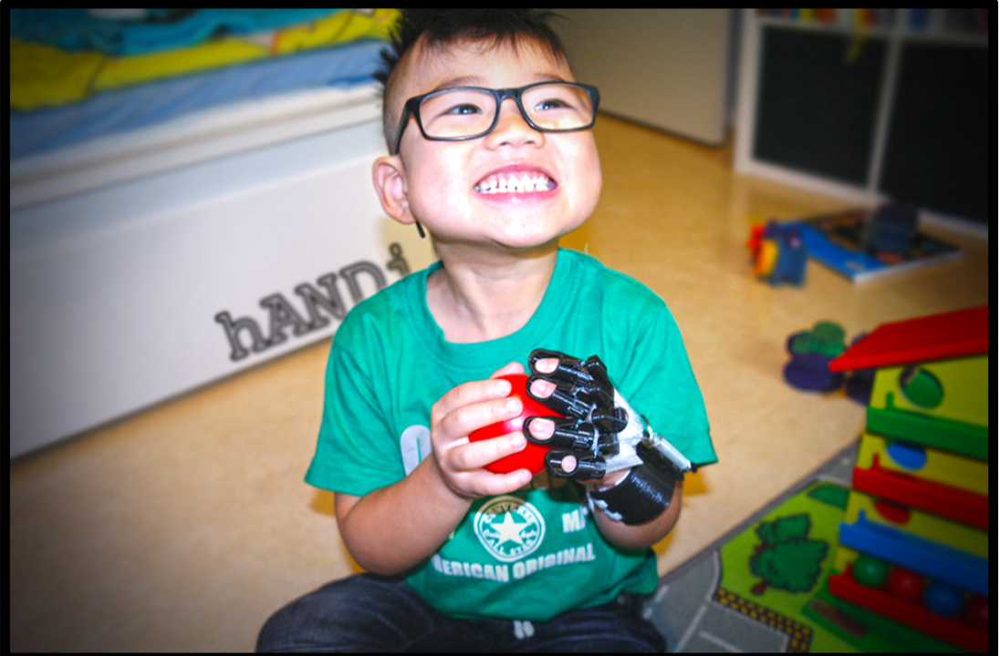
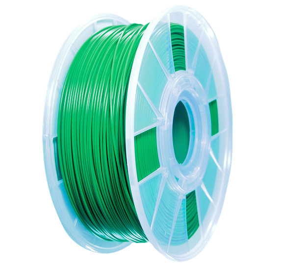
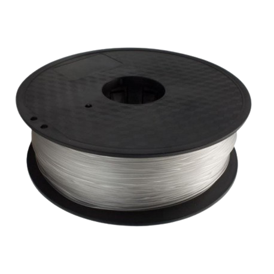
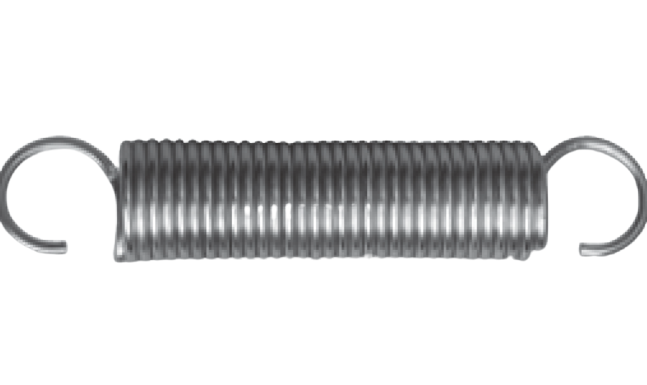
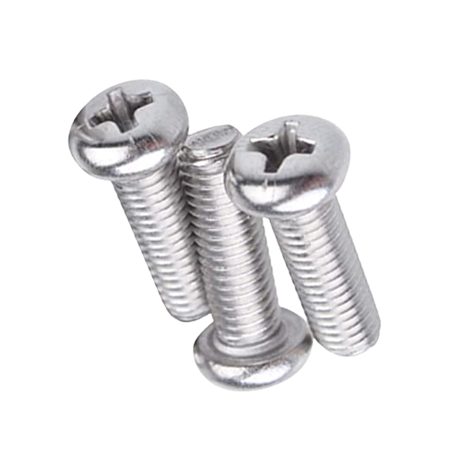
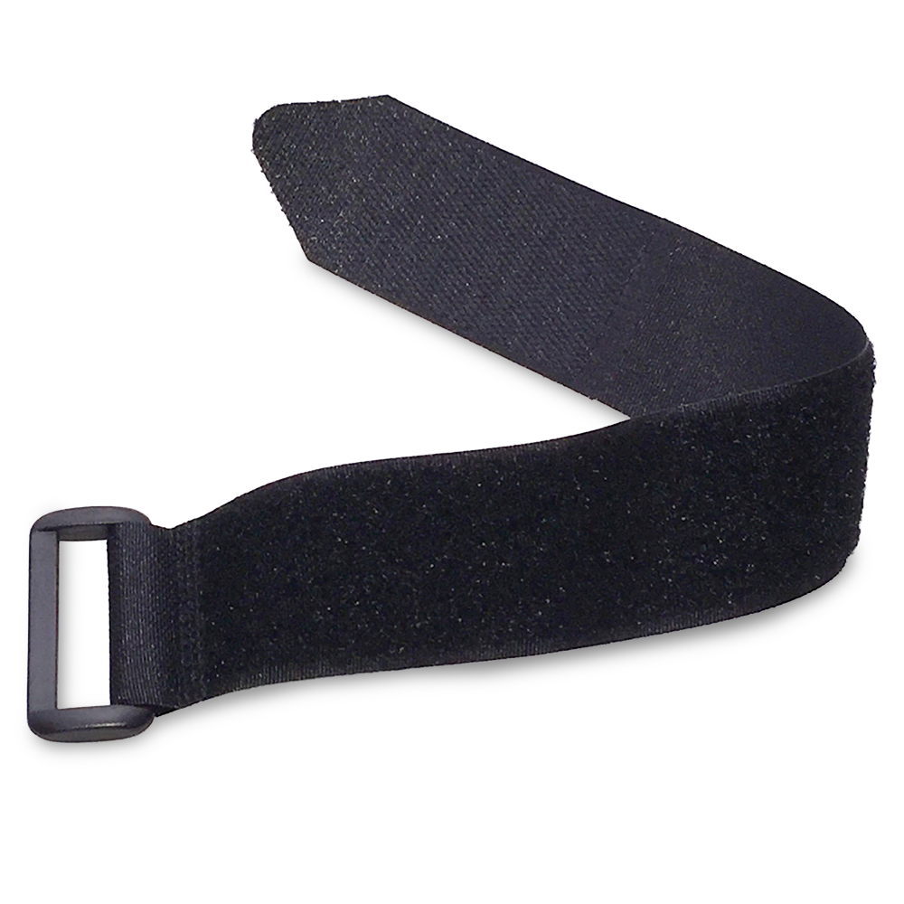
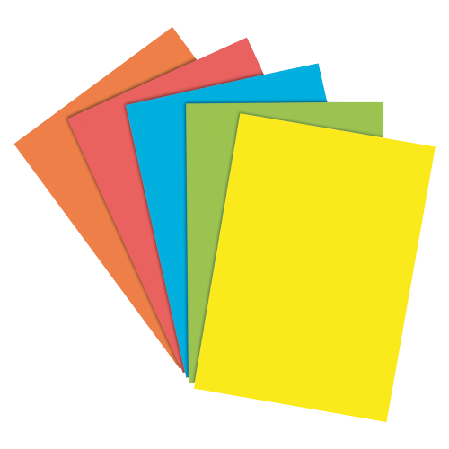
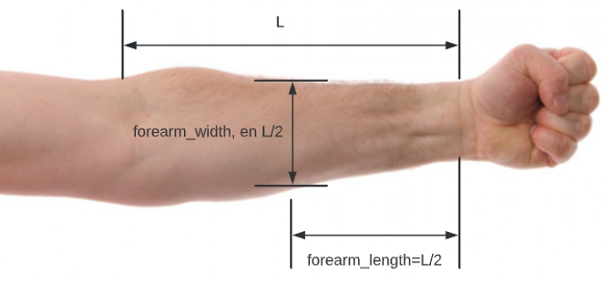
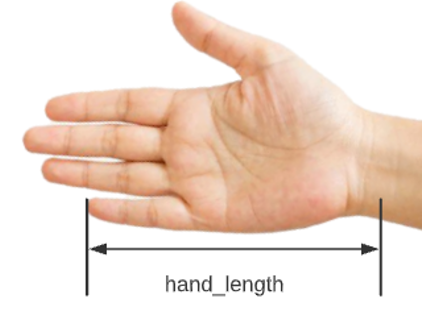
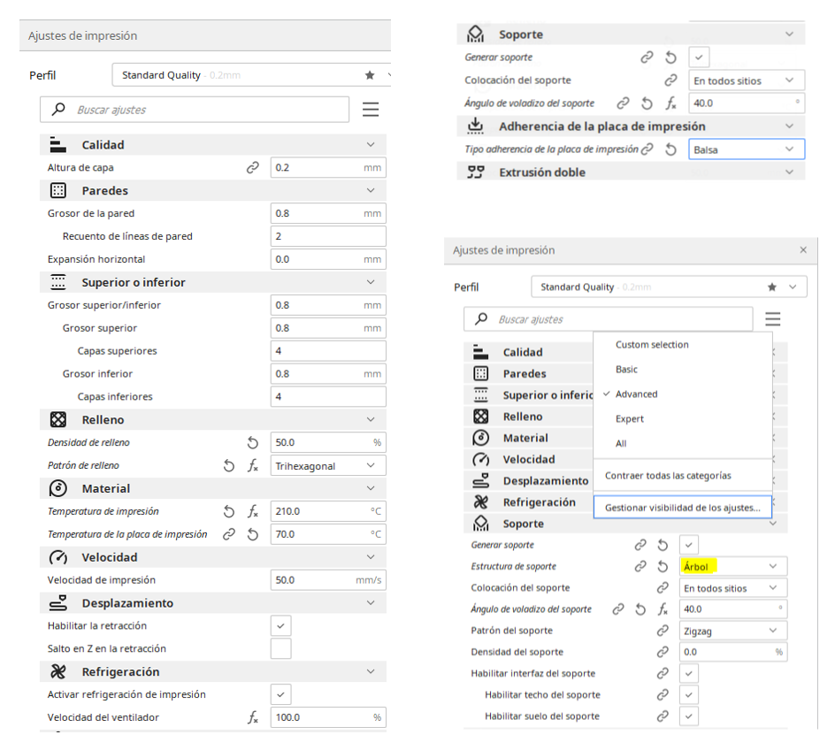

# Ortesis dinámica extensora de mano

En este repositorio se encuentra la parametrización de una órtesis dinámica extensora para la movilidad de las manos.
El diseño de este sistema esta dirigido a personas con problemas  en las articulaciones o tendones que les impida abrir las manos pero si tengan la capacidad de cerrarlas.
El diseño se lo obtuvo de [Thingiverse](https://www.thingiverse.com/thing:1064647) en el repositorio del usuario Emanuel Teljemo.

# Softwares
Se usaron dos softwares. 
 - `OpenScad`: Un software libre para creación de objetos sólidos CAD por medio de programación, gracias a la programación tenemos control total del diseño de la pieza y podemos crear funciones que dependiendo de lo que se le ingresa, nos da como salida piezas de diferentes medidas.
Esto lo aprovechamos para que al final del desarrollo del código se puedan simplemente ingresar ciertas medidas específicas que debe de tener el sistema para adaptarse a su usuario, siendo así que no hay que diseñar TODO de nuevo para cada paciente. 
 - `Cura`: Programa usado para impresión 3D. Este permite ciertos parámetros de impresión para que puedan ser transformados en código G.

# Funcionamiento
La órtesis permite el movimiento de mano para personas que tienen problemas con abrirla. Esto lo hace gracias a que se usan resortes que sirven para regresar la mano al estado de completamente abierta.
En este caso se usan solamente dos resortes, uno para el pulgar y otro para los demás dedos.

# Materiales

| Elemeto | Cantidad | Figura |
| :--- | :---: | :---: |
| Filamento PLA | 1 |  |
| Hilo de Nylon (no elástico) | 1 |  |
| Resorte o muelle | 2 |  |
| Tornillo M5x10mm   Tornillo M5x25mm  y sus respectivas tuercas | 6  2   ... |  |
| Velcro | 1 |  |
| Fomix | 1 |  |

# Medidas del Paciente
Para la generación de la órtesis en el software OpenScad, se necesitan 7 medidas del antebrazo y mano. A continuación, se hablará de cada una de ellas.

    
    

        <i>Medidas del antebrazo</i>
    

Para empezar, se explicarán las dos primeras variables correspondientes a las medidas del antebrazo, como se observa en la figura anterior, se tiene que la variable `forearm_length` es la mitad de la longitud del antebrazo, es decir, L/2. Luego se tiene que `forearm_width` es el ancho del antebrazo, cabe recalcar que dicho ancho será medido en L/2, esto es de suma importancia ya que el antebrazo no tiene un ancho uniforme a lo largo del mismo.

Como recomendación se tiene que a la variable `forearm_width` se le debe sumar 10-12 milímetros aproximadamente (offset) debido a que se utiliza fómix en una pieza para que no lastime la piel del usuario, de forma que reduce el diámetro inicial.

    
    

        <i>Medidas de la mano</i>
    

Para la mano se tendrá una sola variable, la cual se llamará `hand_length`, esta será medida desde la muñeca hasta la parte superior o tope del dedo meñique como se observa en la figura anterior.

    
    

        <i>Medidas del dedo</i>
    

Como se puede observar en la figura anterior, para los dedos se tienen 4 medidas:

- `FingerLength` es medido desde el inicio de la falange distal hasta la punta del dedo
- `FingerWidth` es el ancho del dedo en la zona de la articulación interfalángica distal
- `FingerTip` es medido desde el nacimiento de la uña hasta la punta del dedo
- `FingerHeight` es el alto del dedo en la zona de la articulación interfalángica distal

Cabe recalcar que este proceso de medición se debe de realizar para los cinco dedos de la mano.

# Piezas generadas
Las piezas a generar son 11:
| Pieza | Descripción | Cantidad | Figura |
| :--- | :--- | :---: | :---: |
| [Hand ring](ortesis_openscad/ORTESIS.scad#L55) | - | 1 |  |
| [Hand Stag Straight](ortesis_openscad/ORTESIS.scad#L263) | - | 1 |  |
| [Thumb Stag](ortesis_openscad/ORTESIS.scad#L444) | - | 1 |  |
| [Overhand](ortesis_openscad/ORTESIS.scad#L221) | - | 1 |  |
| [Fingers](ortesis_openscad/ORTESIS.scad#L532) | - | 5 |  |
| [Knut botton](ortesis_openscad/Knut_1_0_bottom_m4nut.stl) | - | 1 |  |
| [Knut top](ortesis_openscad/Knut_1_0_top_plug4mm.stl) | - | 1 |  |

Como vemos en la tabla, las primeras 5 piezas mencionadas las podemos obtener del archivo OpenScad que programamos, pero las últimas 2 piezas no son parametrizadas. Esas son piezas que no deben de ser modificadas proporcionadas por 
Emanuel Teljemo de su repositorio en [Thingiverse](https://www.thingiverse.com/thing:1064647).

Para generar las piezas, Se deben de seguir los siguientes pasos:
 1. Tomarle las medidas necesarias al paciente e ingresar los parámetros especificados en el archivo `ORTESIS.scad` desde la [línea 13 a la 34](ortesis_openscad/ORTESIS.scad#L13)
 2. Especificar si es para la mano derecha o la izquierda [(línea 10)](ortesis_openscad/ORTESIS.scad#L10)
 3. Especificar qué pieza se quiere generar [(línea 6)](ortesis_openscad/ORTESIS.scad#L6)
 4. Repetir el 3er paso para todas las piezas.

# Configuración del Software de impresión
Se utilizó el software Cura para la impresión, pero básicamente todos se pueden configurar con los mismos parámetros especificados. Los parámetros de impresión utilizados para la impresión son los siguientes:

   

# Ensamblaje del las piezas impresas

# Recomendaciones
 - Para la **generación del archivo STL** de la pieza **‘hand ring’** se debe de aumentarle un offset ya que se utiliza fómix en el interior de dicha pieza para que no lastime la piel del usuario, lo que causa que el diámetro inicial sea menor. El valor recomendado es de 10 a 12 mm de más.
 - **Para** la realizar la **compra del resorte**, se debe de tener en cuenta que la fuerza y largo de dicho resorte debe ser el apropiado para el usuario. De forma general, para manos grandes se necesita más fuerza y largo, y para manos pequeñas se utiliza resortes no tan fuertes y no tan largos. Si se utilizan resortes en los que se deba de aplicar demasiada fuerza esto puede generar que se le corte la circulación al paciente.
 - Para colocar los **hilos de nylon** en la órtesis, se debe de cortar de forma correcta el largo de los hilos, ya que si es muy largo no podrá estirar los dedos, y si es muy corto, los estirará mucho.
 - Es importante verificar que los **tornillos lleguen al tope** de la unión de dos piezas, debido a que los resortes pueden chocar con el exceso del tornillo si este es muy largo, por ende, se recomienda utilizar tornillos de 5 mm de diámetro y 10 mm de alto, a excepción de la pieza ‘Knut’.
 - Se recomienda cambiar el tipo de soporte convencional a tipo árbol para la **impresión de los Fingers** ya que facilita el despegue del material de soporte.
 - Para la **medición e impresión de los dedos**, será un proceso iterativo debido a que cada persona tiene diferentes tipos de dedos (anchos, flacos, largos), por eso, es importante mencionar que cada dedo tendrá un **offset** en particular para que al usuario no le quede ni tan suelto o ajustado. Se recomienda sumarle entre 1 y 1.5 mm a las medidas que uno realiza y seguir iterando hasta tener las medidas correctas.
 - Se recomienda utilizar un calibrador vernier para medir las variables necesarias para la creación de la órtesis, en la medición de la longitud del largo del antebrazo (L) se puede utilizar una cinta métrica o una regla de 30 cm si es posible. En caso de usar el calibrador, es mejor si tiene acoplado un material para alargar la mordaza fija, esto permitiría medir de mejor forma el largo de los dedos.

